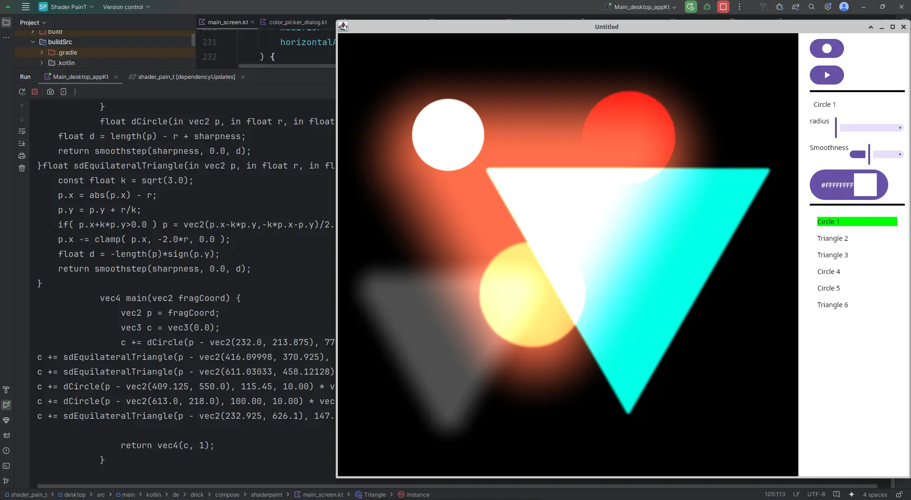

# Shader PainT

A kind of oldscool paint that produces shader code instead of bmp files, which can then be executed on the graphics card.

At the moment you can add circles and triangles to the drawing area. You can then select them and change various attributes. With each change, the shader code is completely regenerated according to an internal data model.

In my [Medium articles about AGSL](https://medium.com/better-programming/using-androids-new-custom-pixel-shader-agsl-in-compose-part-3-b3e2755085db)
I show how the math behind painting with shaders works. But with this application you can get a jump start on your shader code and use it as a base for further fine-tuning.

The generated shader code is rendered using compose multiplatform custom shaders. It is compatible with GLSL (OpenGL Shader Language) and SKSL (SKia Shader Language) as well as with AGSL (Android Graphics Shader Language).

It runs also as wasm, you can see a demo here:

https://drick.de/shaderpaint
